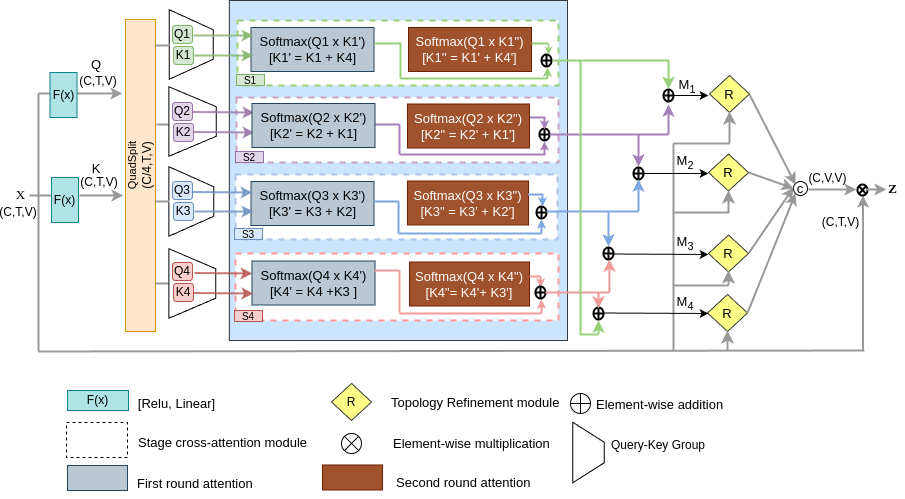
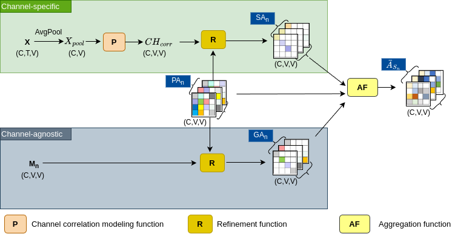

# MSA-GCN
Official PyTorch implementation of "MSA-GCN: Exploiting Multi-Scale Temporal Dynamics with Adaptive Graph Convolution for Skeleton-Based Action Recognition"
## Architecture


## Abstract
Graph convolutional networks (GCNs) have been widely used and have achieved remarkable results in skeleton-based action recognition. State-of-the-art (SOTA) GCNs exploit intra-sequence context to construct adaptive graphs for feature aggregation. However, we argue that the context is still local since the cross-sequence relations have not been explicitly investigated. In this paper, we propose a Multi-stage Adaptive Graph Convolution Network (MSA-GCN), which is a novel approach to skeleton-based action recognition. It consists of two modules: Multi-stage Adaptive Graph Convolution (MSA-GC) and Temporal Multi-Scale Transformer (TMST). These two modules work together to capture complex spatial and temporal patterns within skeleton data effectively. Specifically, MSA-GC explores both local and global contexts across all sequences to construct the adaptive graph and facilitates a more nuanced understanding of the inter-joint relationships. On the other hand, the TMST module integrates a Gated Multi-stage Temporal Convolution (GMSTC) with a Temporal Multi-Head Self-Attention (TMHSA) to capture global temporal features and accommodate both long-term and short-term dependencies within action sequences. Through extensive experiments on multiple benchmark datasets, including NTURGB+D 60, NTURGB+D 120, and Northwestern-UCLA, MSA-GCN achieves state-of-the-art performance and verifies its effectiveness in skeleton-based action recognition.

## Dependencies

- Python >= 3.6
- PyTorch >= 1.7.0
- tqdm, tensorboardX, wandb

## Data Preparation

### Download datasets.

#### There are 3 datasets to download:

- NTU RGB+D 60 Skeleton
- NTU RGB+D 120 Skeleton
- NW-UCLA

#### NTU RGB+D 60 and 120

1. Request dataset here: https://rose1.ntu.edu.sg/dataset/actionRecognition
2. Download the skeleton-only datasets:
   1. `nturgbd_skeletons_s001_to_s017.zip` (NTU RGB+D 60)
   2. `nturgbd_skeletons_s018_to_s032.zip` (NTU RGB+D 120)
   3. Extract above files to `./data/nturgbd_raw`

#### NW-UCLA

1. Download dataset from [here](https://www.dropbox.com/s/10pcm4pksjy6mkq/all_sqe.zip?dl=0)
2. Move `all_sqe` to `./data/NW-UCLA`

### Data Processing

#### Directory Structure

Put downloaded data into the following directory structure:

```
- data/
  - NW-UCLA/
    - all_sqe
      ... # raw data of NW-UCLA
  - ntu/
  - ntu120/
  - nturgbd_raw/
    - nturgb+d_skeletons/     # from `nturgbd_skeletons_s001_to_s017.zip`
      ...
    - nturgb+d_skeletons120/  # from `nturgbd_skeletons_s018_to_s032.zip`
      ...
```

#### Generating Data

- Generate NTU RGB+D 60 or NTU RGB+D 120 dataset:

```
 cd ./data/ntu # or cd ./data/ntu120
 # Get skeleton of each performer
 python get_raw_skes_data.py
 # Remove the bad skeleton 
 python get_raw_denoised_data.py
 # Transform the skeleton to the center of the first frame and vertically align to the ground
 python seq_transformation.py

# Training & Testing

### Training

- Change the config file depending on what you want.
- To train the model run:

``` 
#### Training
- To train MSGCN on NTU RGB+D 60 cross subject with GPU 0
```
python train_transformer.py --config ./configs/ntu60-xsub/joint.yaml --work-dir work_dir/ntu60/xsub/joint_CUDNN/runs --device 0
```
- To ensemble the results of different modalities, run the following command:

```
python ensemble.py \
   --dataset=ntu/xsub \
   --position_ckpts \
      <work_dir_1>/files/best_score.pkl \
      <work_dir_2>/files/best_score.pkl \
      ...
   --motion_ckpts \
      <work_dir_3>/files/best_score.pkl \
      <work_dir_4>/files/best_score.pkl \
      ...
```

Pretrained weights are provided in the [link](https://drive.google.com/)
